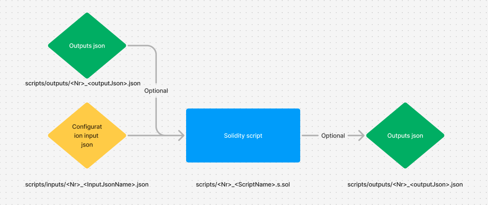

# 📜 **Table of Contents**
1. [🔍 Overview](#overview)
2. [💡 How to Use Scripts](#how-to-use-scripts)
3. [🛠️ Configuration Files](#configuration-files)
   - [🧪 0_MockedTokens](#0_mockedtokens)
   - [🏗️ 1_DeploymentConfig (Main Pool)](#1_deploymentconfig)
   - [🏗️ 2_DeploymentConfig (Mini Pool)](#2_deploymentconfig)
   - [📈 3_StratsToAdd](#3_stratstoadd)
   - [💰 4_AssetsToAdd](#4_assetstoadd)
   - [🔧 5_Reconfigure](#5_reconfigure)
   - [🏦 6_ChangePeripherials](#6_changeperipherials)
   - [🔧 7_TransferOwnerships](#7_transferownerships)
   - [🧪 8_TestConfig](#8_testconfig)
4. [📤 Output Files](#output-files)
   - [🧪 0_MockedTokens Output](#0_mockedtokens)
   - [🏦 1_LendingPoolContracts](#1_lendingpoolcontracts)
   - [🏦 2_MiniPoolContracts](#2_minipoolcontracts)
   - [📊 3_DeployedStrategies](#3_deployedstrategies)

### Overview
Scripts allow to deploy Cod3x-Lend infrastructure and properly configure it.
The deployment process involves configuration files `./input/<Nr>_<InputJsonName>.json` and corresponding scripts `(./<Nr>_<ScriptName>.s.sol)`. Typically, the scripts should be executed in numerical order. They generate output json files with deployed contract addresses that can be used by next script without the need to configure manually. Each script file requires at least one configuration file to be available and properly configured (example configurations with all descriptions are available [here](#configuration-files)). The scripts may require also more json files as an inputs generated from previous scripts and available in `./outputs` folder.



### How to use scripts
1. **Fill .env (determine what kind of scripts you want to run LOCAL_FORK/TESTNET/MAINNET)**
2. **Write data into configuration file scripts/inputs/<nr>_<configName>.json**
3. **Run the script:**
   - **Fork**:
     - compatible script numbers <Nr> to run (1 - 8)
     - local fork runs also the previous script in order to get all necessary contracts so in this variant the order doesn't matter - it is possible to run script with last number without running scripts with prior numbers
     - configuration with corresponding number shall be filled
     - run `forge script scripts/<nr>_<scriptName>.s.sol`
   - **Testnet**: 
      - compatible script numbers `<Nr>` to run (0 - 7)
      - there is need to have executed script 0_DeployMocks.s.sol in order to have ERC20 token mocks
      - there is need to have already executed script with previous `<Nr>`
      - import env variables via `source .env`
      - run `forge script scripts/<nr>_<scriptName>.s.sol --chain-id <chainId> --rpc-url $<RPC_URL> -vvvv --broadcast` for deployment
      - run `forge script scripts/<nr>_<scriptName>.s.sol --chain-id $<RPC_URL> --rpc-url $<RPC_URL> --etherscan-api-key $ETHERSCAN_KEY --broadcast -vvvv --sender <sender address>` if sender is required
      - run `forge script scripts/<nr>_<scriptName>.s.sol --chain-id <chainId> --rpc-url $<RPC_URL> --broadcast -vvvv --private-key $PRIVATE_KEY` if sender is required
   - **Mainnet**:
      - compatible script numbers <Nr> to run (1 - 7)
   - **Mainnet/Testnet tests**
     - `forge script scripts/<nr>_<scriptName>.s.sol --chain-id <chainId> --rpc-url $<RPC_URL> --broadcast -vvvv --private-keys $USER1_PRIVATE_KEY --private-keys $USER2_PRIVATE_KEY --private-keys $DIST_PRIVATE_KEY --sender <EoaAddress>`
   - **Verification**
     - Blockscout - `forge script scripts/<nr>_<scriptName>.s.sol --chain-id <chainId> --rpc-url $$<RPC_URL> --resume --verify --verifier blockscout --verifier-url $<VerifierUrl> --private-key $PRIVATE_KEY`

### Configuration files
**Important !!** All params listed inside json's keys MUST be in alphabetical order !
##### **0_MockedTokens**
  - Shall be used only for testnet deployments or for new tokens in mainnet 
  - Shall contain all not deplyed tokens we want to use in next scripts with token symbols the same that will be used in reserve configuration
  - Example:
    ```json
    {
        "mockedToken": [
            {
                "decimals": 18,
                "prices": 2.5e8,
                "symbol": "WETH"
            },
            {
                "decimals": 6,
                "prices": 1e8,
                "symbol": "USDC"
            },
            {
                "decimals": 8,
                "prices": 64e8,
                "symbol": "WBTC"
            },
            {
                "decimals": 18,
                "prices": 1e8,
                "symbol": "USDT"
            }
        ]
    }
    ```
##### **1_DeploymentConfig**
  - Shall be used for deployment of the main lending pool
  - Example:
    ```json
    {
        "general": {
            "aTokenNamePrefix": "Cod3x Lend ",
            "aTokenSymbolPrefix": "cl",
            "debtTokenNamePrefix": "Cod3x Lend variable debt bearing ",
            "debtTokenSymbolPrefix": "variableDebt",
            "treasury": "0x3151CfCA393FE5Eec690feD2a2446DA5a073d01B"
        },
        "poolAddressesProviderConfig": {
            "marketId": "UV TestNet Market", // name of the market
            "poolId": 0 // Id of the pool (used for mini pools)
        },
        // List of reserves and their configurations
        "poolReserversConfig": [
            {
                "baseLtv": 7000,
                "borrowingEnabled": true,
                "interestStrat": "PI", // Type of the strategy: VOLATILE / STABLE / PI
                "interestStratId": 0, // Id of strategy choosen from all available strategies deployed or listed in configuration
                "liquidationBonus": 10500,
                "liquidationThreshold": 7500,
                "params": "0x10",
                "rates": 0.03e27,
                "reserveFactor": 1500,
                "reserveType": true,
                "symbol": "WETH",
                "tokenAddress": "0x4200000000000000000000000000000000000006"
            }
        ],
        // List of volatile interest strategies and their configurations
        "volatileStrategies": [
            {
                "baseVariableBorrowRate": 0e27,
                "optimalUtilizationRate": 0.45e27,
                "variableRateSlope1": 0.07e27,
                "variableRateSlope2": 3e27
            }
        ],
        // List of stable interest strategies and their configurations
        "stableStrategies": [
            {
                "baseVariableBorrowRate": 0e27,
                "optimalUtilizationRate": 0.8e27,
                "variableRateSlope1": 0.04e27,
                "variableRateSlope2": 0.75e27
            }
        ],
        // List of pi interest strategies and their configurations
        "piStrategies": [
            {
                "assetReserveType": true,
                "ki": 13e19,
                "kp": 1e27,
                "maxITimeAmp": 1728000,
                "minControllerError": -400e24,
                "optimalUtilizationRate": 45e25,
                "symbol": "WETH",
                "tokenAddress": "0x4200000000000000000000000000000000000006"
            }
        ],
        // All necessary configuration to deploy oracle for specified assets
        "oracleConfig": {
            "assets": [
                "0x4200000000000000000000000000000000000006"
            ],
            "baseCurrency": "0x0000000000000000000000000000000000000000",
            "baseCurrencyUnit": 1e18,
            "fallbackOracle": "0x0000000000000000000000000000000000000000",
            "sources": [
                "0x639Fe6ab55C921f74e7fac1ee960C0B6293ba612"
            ]
        }
    }
    ```
##### **2_DeploymentConfig**
  - Shall be used for deployment of the mini pool
  - Example:
    ```json
    {
        "general": {
            "aTokenNamePrefix": "Cod3x Lend ",
            "aTokenSymbolPrefix": "cl",
            "debtTokenNamePrefix": "Cod3x Lend variable debt bearing ",
            "debtTokenSymbolPrefix": "variableDebt",
            "treasury": "0x3151CfCA393FE5Eec690feD2a2446DA5a073d01B"
            
        },
        "poolAddressesProviderConfig": {
            "marketId": "UV TestNet Market", // name of the market
            "poolId": 0 // Id of the pool (used for mini pools)
        },
        // List of reserves and their configurations
        "poolReserversConfig": [
            {
                "baseLtv": 7000,
                "borrowingEnabled": true,
                "interestStrat": "VOLATILE", // Type of the strategy: VOLATILE / STABLE / PI
                "interestStratId": 0, // Id of strategy choosen from all available strategies deployed or listed in configuration
                "liquidationBonus": 10500,
                "liquidationThreshold": 7500,
                "params": "0x10",
                "rates": 0.03e27,
                "reserveFactor": 1500,
                "reserveType": true,
                "symbol": "WETH",
                "tokenAddress": "0x4200000000000000000000000000000000000006"
            },
            {
                "baseLtv": 7000,
                "borrowingEnabled": true,
                "interestStrat": "STABLE",
                "interestStratId": 0,
                "liquidationBonus": 10500,
                "liquidationThreshold": 7500,
                "params": "0x10",
                "rates": 0.03e27,
                "reserveFactor": 1500,
                "reserveType": true,
                "symbol": "USDC",
                "tokenAddress": "0x833589fCD6eDb6E08f4c7C32D4f71b54bdA02913"
            }
        ],
        // List of volatile interest strategies and their configurations
        "volatileStrategies": [
            {
                "baseVariableBorrowRate": 0e27,
                "optimalUtilizationRate": 0.45e27,
                "variableRateSlope1": 0.07e27,
                "variableRateSlope2": 3e27
            }
        ],
        // List of stable interest strategies and their configurations
        "stableStrategies": [
            {
                "baseVariableBorrowRate": 0e27,
                "optimalUtilizationRate": 0.75e27,
                "variableRateSlope1": 0.01e27,
                "variableRateSlope2": 0.1e27
            }
        ],
        // List of pi interest strategies and their configurations
        "piStrategies": [
            {
                "assetReserveType": true,
                "ki": 13e19,
                "kp": 1e27,
                "maxITimeAmp": 1728000,
                "minControllerError": -400e24,
                "optimalUtilizationRate": 45e25,
                "symbol": "WETH",
                "tokenAddress": "0x4200000000000000000000000000000000000006"
            },
            {
                "assetReserveType": true,
                "ki": 13e19,
                "kp": 1e27,
                "maxITimeAmp": 1728000,
                "minControllerError": -400e24,
                "optimalUtilizationRate": 45e25,
                "symbol": "USDC",
                "tokenAddress": "0x833589fCD6eDb6E08f4c7C32D4f71b54bdA02913"
            }
        ],
        // All necessary configuration to deploy oracle for specified assets
        "oracleConfig": {
            "assets": [
                "0x4200000000000000000000000000000000000006",
                "0x833589fCD6eDb6E08f4c7C32D4f71b54bdA02913"
            ],
            "baseCurrency": "0x0000000000000000000000000000000000000000",
            "baseCurrencyUnit": 1e18,
            "fallbackOracle": "0x0000000000000000000000000000000000000000",
            "sources": [
                "0x639Fe6ab55C921f74e7fac1ee960C0B6293ba612",
                "0x50834F3163758fcC1Df9973b6e91f0F0F0434aD3"
            ]
        }
    }
    ```
##### **3_StratsToAdd**
  - Shall be used to deploy interest strategies 
  - Example:
    ```json
    {
        // List of volatile interest strategies and their configurations for main lending pool
        "volatileStrategies": [
            {
                "baseVariableBorrowRate": 0e27,
                "optimalUtilizationRate": 0.45e27,
                "variableRateSlope1": 0.07e27,
                "variableRateSlope2": 3e27
            }
        ],
        // List of stable interest strategies and their configurations for main lending pool
        "stableStrategies": [
            {
                "baseVariableBorrowRate": 0e27,
                "optimalUtilizationRate": 0.75e27,
                "variableRateSlope1": 0.01e27,
                "variableRateSlope2": 0.1e27
            }
        ],
        // List of pi interest strategies and their configurations for main lending pool
        "piStrategies": [
            {
                "assetReserveType": true,
                "ki": 13e19,
                "kp": 1e27,
                "maxITimeAmp": 1728000,
                "minControllerError": -400e24,
                "optimalUtilizationRate": 45e25,
                "symbol": "WBTC",
                "tokenAddress": "0x0555E30da8f98308EdB960aa94C0Db47230d2B9c"
            },
            {
                "assetReserveType": true,
                "ki": 13e19,
                "kp": 1e27,
                "maxITimeAmp": 1728000,
                "minControllerError": -400e24,
                "optimalUtilizationRate": 45e25,
                "symbol": "USDC",
                "tokenAddress": "0x833589fCD6eDb6E08f4c7C32D4f71b54bdA02913"
            }
        ],
        // List of volatile interest strategies and their configurations for mini pool
        "miniPoolVolatileStrategies": [
            {
                "baseVariableBorrowRate": 0e27,
                "optimalUtilizationRate": 0.45e27,
                "variableRateSlope1": 0.07e27,
                "variableRateSlope2": 3e27
            }
        ],
        // List of stable interest strategies and their configurations for mini pool
        "miniPoolStableStrategies": [
            {
                "baseVariableBorrowRate": 0e27,
                "optimalUtilizationRate": 0.45e27,
                "variableRateSlope1": 0.07e27,
                "variableRateSlope2": 3e27
            }
        ],
        // List of pi interest strategies and their configurations for mini pool
        "miniPoolPiStrategies": [
            {
                "assetReserveType": true,
                "ki": 13e19,
                "kp": 1e27,
                "maxITimeAmp": 1728000,
                "minControllerError": -400e24,
                "optimalUtilizationRate": 45e25,
                "symbol": "WBTC",
                "tokenAddress": "0x0555E30da8f98308EdB960aa94C0Db47230d2B9c"
            },
            {
                "assetReserveType": true,
                "ki": 13e19,
                "kp": 1e27,
                "maxITimeAmp": 1728000,
                "minControllerError": -400e24,
                "optimalUtilizationRate": 45e25,
                "symbol": "USDT",
                "tokenAddress": "0xfde4C96c8593536E31F229EA8f37b2ADa2699bb2"
            }
        ]
    }
    
    ```
##### **4_AssetsToAdd**
  - Shall be used to add new assets into reserves
  - Example:
    ```json

    {
        "general": {
            "aTokenNamePrefix": "Cod3x Lend ",
            "aTokenSymbolPrefix": "cl",
            "debtTokenNamePrefix": "Cod3x Lend variable debt bearing ",
            "debtTokenSymbolPrefix": "variableDebt",
            "treasury": "0x3151CfCA393FE5Eec690feD2a2446DA5a073d01B"
        },
        "poolAddressesProviderConfig": {
            "marketId": "UV TestNet Market",
            "poolId": 0
        },
        // List of reserves and their configurations for main lennding pool
        "lendingPoolReserversConfig": [
            {
                "baseLtv": 7000,
                "borrowingEnabled": true,
                "interestStrat": "VOLATILE", // Type of the strategy: VOLATILE / STABLE / PI
                "interestStratId": 0, // Id of strategy choosen from all available strategies deployed or listed in configuration. In this case all strats are listed in ./outputs/DeployedStrategies.json
                "liquidationBonus": 10500,
                "liquidationThreshold": 7500,
                "params": "0x10",
                "rates": 0.03e27,
                "reserveFactor": 1500,
                "reserveType": true,
                "symbol": "WBTC",
                "tokenAddress": "0x0555E30da8f98308EdB960aa94C0Db47230d2B9c"
            },
            {
                "baseLtv": 7000,
                "borrowingEnabled": true,
                "interestStrat": "PI",
                "interestStratId": 2,
                "liquidationBonus": 10500,
                "liquidationThreshold": 7500,
                "params": "0x10",
                "rates": 0.03e27,
                "reserveFactor": 1500,
                "reserveType": true,
                "symbol": "USDC",
                "tokenAddress": "0x833589fCD6eDb6E08f4c7C32D4f71b54bdA02913"
            }
        ],
        // List of reserves and their configurations for mini pool
        "miniPoolReserversConfig": [
            {
                "baseLtv": 7000,
                "borrowingEnabled": true,
                "interestStrat": "VOLATILE",
                "interestStratId": 0, // Id of strategy choosen from all available strategies deployed or listed in configuration. In this case all strats are listed in ./outputs/DeployedStrategies.json
                "liquidationBonus": 10500,
                "liquidationThreshold": 7500,
                "params": "0x10",
                "rates": 0.03e27,
                "reserveFactor": 1500,
                "reserveType": true,
                "symbol": "WBTC",
                "tokenAddress": "0x0555E30da8f98308EdB960aa94C0Db47230d2B9c"
            },
            {
                "baseLtv": 7000,
                "borrowingEnabled": true,
                "interestStrat": "STABLE",
                "interestStratId": 0, // Id of strategy choosen from all available strategies deployed or listed in configuration. In this case all strats are listed in ./outputs/DeployedStrategies.json
                "liquidationBonus": 10500,
                "liquidationThreshold": 7500,
                "params": "0x10",
                "rates": 0.03e27,
                "reserveFactor": 1500,
                "reserveType": true,
                "symbol": "USDT",
                "tokenAddress": "0xfde4C96c8593536E31F229EA8f37b2ADa2699bb2"
            }
        ],
        // All necessary configuration to deploy oracle for specified assets
        "oracleConfig": {
            "assets": [
                "0x4200000000000000000000000000000000000006",
                "0x833589fCD6eDb6E08f4c7C32D4f71b54bdA02913",
                "0x0555E30da8f98308EdB960aa94C0Db47230d2B9c",
                "0xfde4C96c8593536E31F229EA8f37b2ADa2699bb2"
            ],
            "baseCurrency": "0x0000000000000000000000000000000000000000",
            "baseCurrencyUnit": 1e18,
            "fallbackOracle": "0x0000000000000000000000000000000000000000",
            "sources": [
                "0x639Fe6ab55C921f74e7fac1ee960C0B6293ba612",
                "0x50834F3163758fcC1Df9973b6e91f0F0F0434aD3",
                "0xd0C7101eACbB49F3deCcCc166d238410D6D46d57",
                "0x3f3f5dF88dC9F13eac63DF89EC16ef6e7E25DdE7"
            ]
        }
    }
    ```
##### **5_Reconfigure**
  - Shall be used to reconfigure reserves parameters
  - Example:
    ```json
    {
        "poolAddressesProviderConfig": {
            "marketId": "UV TestNet Market",
            "poolId": 0
        },
        // List of reserves and their configurations for main lending pool
        "lendingPoolReserversConfig": [
            {
                "baseLtv": 7000,
                "borrowingEnabled": true,
                "interestStrat": "VOLATILE", // Type of the strategy: VOLATILE / STABLE / PI
                "interestStratId": 1, // Id of strategy choosen from all available strategies deployed or listed in configuration. In this case all strats are listed in ./outputs/DeployedStrategies.json
                "liquidationBonus": 10400,
                "liquidationThreshold": 7400,
                "params": "0x10",
                "rates": 0.04e27,
                "reserveFactor": 1500,
                "reserveType": true,
                "symbol": "WBTC",
                "tokenAddress": "0x0555E30da8f98308EdB960aa94C0Db47230d2B9c"
            },
            {
                "baseLtv": 7000,
                "borrowingEnabled": true,
                "interestStrat": "STABLE", // Type of the strategy: VOLATILE / STABLE / PI
                "interestStratId": 1, // Id of strategy choosen from all available strategies deployed or listed in configuration. In this case all strats are listed in ./outputs/DeployedStrategies.json
                "liquidationBonus": 10500,
                "liquidationThreshold": 7400,
                "params": "0x10",
                "rates": 0.03e27,
                "reserveFactor": 1500,
                "reserveType": true,
                "symbol": "USDC",
                "tokenAddress": "0x833589fCD6eDb6E08f4c7C32D4f71b54bdA02913"
            }
        ],
        // List of reserves and their configurations for mini pool
        "miniPoolReserversConfig": [
            {
                "baseLtv": 7000,
                "borrowingEnabled": true,
                "interestStrat": "VOLATILE", // Type of the strategy: VOLATILE / STABLE / PI
                "interestStratId": 1, // Id of strategy choosen from all available strategies deployed or listed in configuration. In this case all strats are listed in ./outputs/DeployedStrategies.json
                "liquidationBonus": 10500,
                "liquidationThreshold": 7700,
                "params": "0x10",
                "rates": 0.02e27,
                "reserveFactor": 1500,
                "reserveType": true,
                "symbol": "WBTC",
                "tokenAddress": "0x0555E30da8f98308EdB960aa94C0Db47230d2B9c"
            },
            {
                "baseLtv": 7000,
                "borrowingEnabled": true,
                "interestStrat": "PI", // Type of the strategy: VOLATILE / STABLE / PI
                "interestStratId": 3, // Id of strategy choosen from all available strategies deployed or listed in configuration. In this case all strats are listed in ./outputs/DeployedStrategies.json
                "liquidationBonus": 10500,
                "liquidationThreshold": 7100,
                "params": "0x10",
                "rates": 0.03e27,
                "reserveFactor": 1600,
                "reserveType": true,
                "symbol": "USDT",
                "tokenAddress": "0xfde4C96c8593536E31F229EA8f37b2ADa2699bb2"
            }
        ]
    }
    
    ```
##### **6_ChangePeripherials**
  - Shall be used to set treasury, vault and rewarder
  - Shall be used to turn on rehypothecation
  - All keys shall have equal number of list elements. For those elements that don't need to configure, the "configure" param shall be set to false
  - Example:
    ```json
    {
        // List of configuration for treasury change
        "treasury": [
            {
                "configure": false, // determine whether treasury needs to be changed for this asset
                "newAddress": "0x3151CfCA393FE5Eec690feD2a2446DA5a073d01B", // new treasury asset
                "reserveType": true,
                "symbol": "USDC",
                "tokenAddress": "0x833589fCD6eDb6E08f4c7C32D4f71b54bdA02913"
            },
            {
                "configure": true, // determine whether treasury needs to be changed for this asset
                "newAddress": "0x3151CfCA393FE5Eec690feD2a2446DA5a073d01B", // new treasury asset
                "reserveType": true,
                "symbol": "WETH",
                "tokenAddress": "0x4200000000000000000000000000000000000006"
            }
        ],
        "vault": [
            {
                "configure": false, // determine whether vault needs to be changed for this asset
                "newAddress": "0x3151CfCA393FE5Eec690feD2a2446DA5a073d01B", // new vault asset
                "reserveType": true,
                "symbol": "USDC",
                "tokenAddress": "0x833589fCD6eDb6E08f4c7C32D4f71b54bdA02913"
            },
            {
                "configure": true, // determine whether vault needs to be changed for this asset
                "newAddress": "0x3151CfCA393FE5Eec690feD2a2446DA5a073d01B", // new vault asset
                "reserveType": true,
                "symbol": "WETH",
                "tokenAddress": "0x4200000000000000000000000000000000000006"
            }
        ],
        "rewarder": [
            {
                "configure": false, // determine whether rewarder needs to be changed for this asset
                "newAddress": "0x3151CfCA393FE5Eec690feD2a2446DA5a073d01B", // new rewarder asset
                "reserveType": true,
                "symbol": "USDC",
                "tokenAddress": "0x833589fCD6eDb6E08f4c7C32D4f71b54bdA02913"
            },
            {
                "configure": true, // determine whether rewarder needs to be changed for this asset
                "newAddress": "0x3151CfCA393FE5Eec690feD2a2446DA5a073d01B", // new rewarder asset
                "reserveType": true,
                "symbol": "WETH",
                "tokenAddress": "0x4200000000000000000000000000000000000006"
            }
        ],
        "rehypothecation": [
            {
                "claimingThreshold": 1e8,
                "configure": false, // determine whether rehypothecation needs to be changed for this asset
                "drift": 200,
                "farmingPct": 2000,
                "profitHandler": "0x3151CfCA393FE5Eec690feD2a2446DA5a073d01B",
                "reserveType": true,
                "symbol": "USDC",
                "tokenAddress": "0x833589fCD6eDb6E08f4c7C32D4f71b54bdA02913",
                "vault": "0x3151CfCA393FE5Eec690feD2a2446DA5a073d01B" // if vault is already set for the asset this param doesn't matter
            },
            {
                "claimingThreshold": 1e8,
                "configure": true, // determine whether rehypothecation needs to be changed for this asset
                "drift": 200,
                "farmingPct": 2000,
                "profitHandler": "0x3151CfCA393FE5Eec690feD2a2446DA5a073d01B",
                "reserveType": true,
                "symbol": "WETH",
                "tokenAddress": "0x4200000000000000000000000000000000000006",
                "vault": "0x3151CfCA393FE5Eec690feD2a2446DA5a073d01B" // if vault is already set for the asset this param doesn't matter
            }
        ]
    }
    ```
##### **7_TransferOwnerships**
   - Shall be run at the end of configuration in order to transfer all contracts ownerships 
   - Example:
   ```json
   {
       "roles": {
           "addressesProviderOwner": "0x3151CfCA393FE5Eec690feD2a2446DA5a073d01B",
           "emergencyAdmin": "0x3151CfCA393FE5Eec690feD2a2446DA5a073d01B",
           "oracleOwner": "0x3151CfCA393FE5Eec690feD2a2446DA5a073d01B",
           "piInterestStrategiesOwner": "0x3151CfCA393FE5Eec690feD2a2446DA5a073d01B",
           "poolAdmin": "0x3151CfCA393FE5Eec690feD2a2446DA5a073d01B",
           "rewarderOwner": "0x3151CfCA393FE5Eec690feD2a2446DA5a073d01B"
       }
   }
   ```
##### **8_TestConfig**
  - Can be in script for fork tests (8_TestBasicActions_Fork.s) or staginf tests (8_TestBasicActions_Staging.s)
  - Shall be used to test basic actions for deployed contracts
  - Example:
    ```json
    {
        // test params
        "collateralAddress": "0x833589fCD6eDb6E08f4c7C32D4f71b54bdA02913",
        "borrowAssetAddress": "0x0555E30da8f98308EdB960aa94C0Db47230d2B9c",
        "depositAmount": 5000000000,
        "bootstrapLiquidity": true, // if the flag is enabled then script deposit assets to all configured reserves
        "poolAddressesProviderConfig": {
            "marketId": "UV TestNet Market",
            "poolId": 0
        }
    }
    ```
### Output files
##### **0_MockedTokens**
  - List of mocked tokens deployed (used for testnet or new tokens)
  - Example:
  ```json
    {
    "mockedTokens": [
        "0x9C6f0f8e1fbBBae2bF463B17ee7f073D11FefbDD",
        "0x09C32EB866c0B54Db3F66d82837464464D39f659",
        "0xAd63737Ad3d1684B0f4BE7c0dd388D5d822ce638",
        "0xAC0bE3C599fdb3eE90635cfdBe60A74f81957Bf3"
    ]
    }
  ```
##### **1_LendingPoolContracts**
  - List of main lending pool infrastructure contracts addresses
  - Used by 2_DeployMiniPool.s, 3_AddStrats.s, 4_AddAssets.s, 5_Reconfigure.s
  - Example:
  ```json
    {
    "aToken": "0xd6F3b6aAE9830543D88344aaCA62F0b3B5c3D817",
    "aTokenErc6909": "0xb84B0b76DF55c4cFAa6040741e529Cb6EEb3AbB8",
    "aTokensAndRatesHelper": "0xC00fCbF9A6f8b8cfC55545Cc422FDfFC49Cff522",
    "lendingPool": "0xf5A3944E2f4B0142857E7E339fc8FeB40cA9d307",
    "lendingPoolAddressesProvider": "0x18bd805089bC4De456204A9e6b4d4790E942064E",
    "lendingPoolCollateralManager": "0x0E7F65B9D519d62059216b212A7539d0f8f4223B",
    "lendingPoolConfigurator": "0x81A79c2807414E57C8f62EFAedC0F650Ffa6aCbF",
    "piStrategies": [
        "0xdb026094f6b5b3A6aEEEBea25c60E5cfE9eB8E49"
    ],
    "cod3xLendDataProvider": "0x270701c499Ce78EC803948B8b9a54cd22CfAAB61",
    "rewarder": "0xD0171e0923f0Dc7Ab24947d5D316Af640cF7f196",
    "stableStrategies": [
        "0xb798354d5731A9EA700a7B3bC3f7bfE30c562003"
    ],
    "treasury": "0xA0A1bD809A69F534226B81E36595aa9c214F8361",
    "variableDebtToken": "0xB5e68092047642559ce3f1077180e00BBF838189",
    "volatileStrategies": [
        "0x5343da84067fD87179C92a8A86D79662CF3cC505"
    ]
    }
  ```
##### **2_MiniPoolContracts**
  - List of mini pool infrastructure contracts addresses
  - Used by 3_AddStrats.s, 4_AddAssets.s, 5_Reconfigure.s
  - Example:
  ```json
    {
    "flowLimiter": "0xec831Be4Ea7697d05dE0cA119A2e1992762c097f",
    "miniPoolAddressesProvider": "0x7AaC9cF081c443EFdb2c762b4867BAb49e079e25",
    "miniPoolConfigurator": "0xF4D062866b30436b99A04b42113687963DB9472e",
    "miniPoolImpl": "0xBe5511dcF99Cef8610Ec0b27801f00913162B560",
    "miniPoolPiStrategies": [
        "0x486056653845AE60d9cEAd581B27A6433fbee660",
        "0x86e4B254Cf1FEdF27EA73eDd51e96e7c5cD24604"
    ],
    "miniPoolStableStrategies": [
        "0xe8D27ce05F3700906162Df7881002f4706d12b0d"
    ],
    "miniPoolVolatileStrategies": [
        "0xDBE218eaDD164E9380F5819F6cf40095Df16Ee94"
    ]
    }
  ```
##### **3_DeployedStrategies**
  - List of all strategies deployed so far 
  - Used by 4_AddAssets.s, 5_Reconfigure.s ***in correct order !***
  - Addresses in the array corresponds with the symbols in the array
  - Example:
  ```json
    {
    "miniPoolPiStrategies": [
        "0x486056653845AE60d9cEAd581B27A6433fbee660",
        "0x86e4B254Cf1FEdF27EA73eDd51e96e7c5cD24604",
        "0xb452eeB187df21592DaDb67E8B0590584415d28D",
        "0x37aD96F513FF0b60f4240734625f40501487D6D0"
    ],
    "miniPoolPiStrategiesSymbols": [
        "WETH",
        "USDC",
        "WBTC",
        "USDT"
    ],
    "miniPoolStableStrategies": [
        "0xe8D27ce05F3700906162Df7881002f4706d12b0d",
        "0x5658eEAF14a785C523Cc838406Fe32e7DaEdf6cb"
    ],
    "miniPoolVolatileStrategies": [
        "0xDBE218eaDD164E9380F5819F6cf40095Df16Ee94",
        "0x7647F3C5f235c7B71a3771F064aC0d608E368707"
    ],
    "piStrategies": [
        "0xdb026094f6b5b3A6aEEEBea25c60E5cfE9eB8E49",
        "0xdF55c0A5e4171b8e9238E01Ebc9725ebd25E1d09",
        "0xF0049934cdCf0d5011aE6c9B6dA4c4F0D082330b"
    ],
    "piStrategiesSymbols": [
        "WETH",
        "WBTC",
        "USDC"
    ],
    "stableStrategies": [
        "0xb798354d5731A9EA700a7B3bC3f7bfE30c562003",
        "0xF86CD7286898138FEAc919097DcD4458Da4a488b"
    ],
    "volatileStrategies": [
        "0x5343da84067fD87179C92a8A86D79662CF3cC505",
        "0xC0d324d5af75BBDf062f2f0DE026a48163875C87"
    ]
    }
  ```