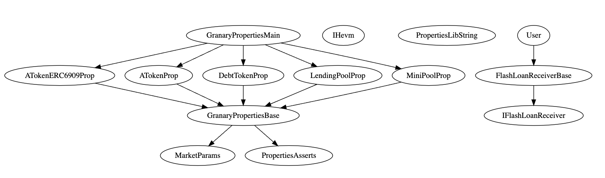

# Fuzzing tests with Echidna/Medusa

Echidna is a program designed for fuzzing/property-based testing of Ethereum smart contracts. Please refer to the doc for [installation](https://github.com/crytic/echidna#installation).

```sh
forge install
echidna tests/echidna/PropertiesMain.sol --contract PropertiesMain --config tests/echidna/config/config1_fast.yaml
```

Medusa: to be fixed.
```sh
cd tests/echidna
medusa fuzz --config medusa_config.json
```

You can fine in `/echidna` 3 config files to run the fuzzer:

- 1< min | `config1_fast.yaml`
- 5< min | `config2_slow.yaml`
- 50 min | `config3_inDepth.yaml`



# TODO

- Add minipools.
- Randomly activation flow borrowing on minipools
- Implemente all "To implement" invariants.
- Fix randBorrow "207", "220", "221".
- Add Medusa support
- Add rewarders.
- test setDepositCap
- fix lastLiquidityIndex and lastBorrowIndex

# Invariant testing

### General (same for the LendingPool and MiniPools)

100. ✅ To be liquidated on a given collateral asset, the target user must own the associated `aTokenColl`.
101. ✅ To be liquidated on a given token, the target user must own the associated `vTokenDebt`.
102. ✅ `liquidationCall()` must only be callable when the target health factor is < 1.
103. ✅ `liquidationCall()` must decrease the target `vTokenDebt` balance by `amount`.
104. ✅ `liquidationCall()` must increase the liquidator `aTokenColl` (or `collAsset`) balance.
105. ✅ `liquidationCall()` must decrease the liquidator debt asset balance if `randReceiveAToken` is true or `collAsset` is not equal to `debtAsset`.

### LendingPool

200. ✅ Users must always be able to deposit in normal condition.
201. ✅ `deposit()` must increase the user aToken balance by `amount`.
202. ✅ `deposit()` must decrease the user asset balance by `amount`.
203. ✅ `withdraw()` must decrease the user aToken balance by `amount`.
204. ✅ `withdraw()` must increase the user asset balance by `amount`.
205. ✅ A user must not be able to `borrow()` if they don't own aTokens.
206. ✅ `borrow()` must only be possible if the user health factor is greater than 1.
207. ❌ `borrow()` must not result in a health factor of less than 1.
208. ✅ `borrow()` must increase the user debtToken balance by `amount`.
209. ✅ `borrow()` must decrease `borrowAllowance()` by `amount` if `user != onBehalf`.
210. ✅ `repay()` must decrease the onBehalfOf debtToken balance by `amount`.
211. ✅ `repay()` must decrease the user asset balance by `amount`.
212. ✅ `healthFactorAfter` must be greater than `healthFactorBefore` as long as liquidations are done in time.
213. ✅ `setUseReserveAsCollateral` must not reduce the health factor below 1.
214. ✅ Users must not be able to steal funds from flashloans.
215. ✅ The total value borrowed must always be less than the value of the collaterals.
216. 🚚
217. ✅ The `liquidityIndex` should monotonically increase when there's total debt.
218. ✅ The `variableBorrowIndex` should monotonically increase when there's total debt.
219. ✅ A user with debt should have at least an aToken balance `setUsingAsCollateral`.
220. ❌ If all debt is repaid, all `aToken` holders should be able to claim their collateral.
221. ❌ If all users withdraw their liquidity, there must not be aTokens supply left.
222. 🚧 Integrity of Supply Cap - aToken supply shall never exceed the cap.
223. 🚧 `UserConfigurationMap` integrity: If a user has a given aToken then `isUsingAsCollateralOrBorrowing` and `isUsingAsCollateral` should return true.
224. 🚧 `UserConfigurationMap` integrity: If a user has a given debtToken then `isUsingAsCollateralOrBorrowing`, `isBorrowing` and `isBorrowingAny` should return true.
225. 🚧 `ReserveConfigurationMap` integrity: If reserve is active and not frozen then user can interact with the lending market.
226. 🚧 Repaying or Liquidating a position must result in the same final state.
227. ❌ Rehypothecation: if the external rehypothecation vault is liquid, users should always be able to withdraw if all other withdrawal conditions are met.
228. ✅ Rehypothecation: farming percentage must be respected (+/- the drift) after a rebalance occured.
229. ✅ Rehypothecation: The profit handler address must see its balance increase after reaching the claiming threshold.
230. ✅ `withdraw()` must not result in a health factor of less than 1.
231. ✅ Rehypothecation: farming percentage must be respected (+/- the drift) after any operation.


### ATokens/ATokenNonRebasing

300. ✅ Zero amount transfers should not break accounting.
301. ✅ Once a user has a debt, they must not be able to transfer aTokens if this results in a health factor less than 1.
302. ✅ Transfers for more than available balance should not be allowed.
303. ✅ Transfers should update accounting correctly.
304. ✅ Self transfers should not break accounting.
305. ✅ Zero amount transfers must not break accounting.
306. ✅ Once a user has a debt, they must not be able to transfer aTokens if this results in a health factor less than 1.
307. ✅ Transfers for more than available balance must not be allowed.
308. ✅ `transferFrom()` must only transfer if the sender has enough allowance from the `from` address.
309. ✅ Transfers must update accounting correctly.
310. ✅ Self transfers must not break accounting.
311. ✅ `transferFrom()` must decrease allowance.
312. ✅ `approve()` must never revert.
313. ✅ Allowance must be modified correctly via `approve()`.
314. ✅ `increaseAllowance()` must never revert.
315. ✅ Allowance must be modified correctly via `increaseAllowance()`.
316. ✅ `decreaseAllowance()` must revert when the user tries to decrease more than currently allowed.
317. ✅ Allowance must be modified correctly via `decreaseAllowance()`.
318. 🚧 User nonce must increase by one.
319. 🚧 Mutation in the signature must make `permit()` revert.
320. 🚧 Mutation in parameters must make `permit()` revert.
321. 🚧 User allowance must be equal to `amount` when the sender calls `permit()`.
322. ✅ Force feeding assets in LendingPool, ATokens, or debtTokens must not change the final result.
323. ✅ Force feeding aToken in LendingPool, ATokens, or debtTokens must not change the final result.
324. ✅ A user must not hold more than total supply.
325. ✅ Sum of users' balances must not exceed total supply.
326. ✅ `ATokenNonRebasing` `balanceOf()` should be equivalent to `ATokens` adjusted to the conversion rate.
327. ✅ `ATokenNonRebasing` `transfer()` should be equivalent to `ATokens` adjusted to the conversion rate.
328. ✅ `ATokenNonRebasing` `transferFrom()` should be equivalent to `ATokens` adjusted to the conversion rate.
329. ✅ Allowance must be modified correctly via `ATokenNonRebasing.approve()`.
330. ✅ `ATokenNonRebasing.approve()` must not modify `AToken.allowance()`.

### DebtTokens

400. ✅ `approveDelegation()` must never revert.
401. ✅ Allowance must be modified correctly via `approve()`.

### MiniPool

500. ✅ Users must always be able to deposit in normal condition.
501. ✅ `deposit()` must increase the user AToken6909 balance by `amount`.
502. ✅ `deposit()` must decrease the user asset balance by `amount`.
503. ✅ `withdraw()` must decrease the user AToken6909 balance by `amount`.
504. ✅ `withdraw()` must increase the user asset balance by `amount`.
505. ✅ `withdraw()` must not result in a health factor of less than 1.
506. ✅ A user must not be able to `borrow()` if they don't own AToken6909.
507. ✅ `borrow()` must only be possible if the user health factor is greater than 1.
508. ✅ `borrow()` must not result in a health factor of less than 1.
509. ✅ `borrow()` must increase the user debtToken balance by `amount`.
510. ✅ `borrow()` must decrease `borrowAllowance()` by `amount` if `user != onBehalf`.
511. ✅ `repay()` must decrease the onBehalfOf debtToken balance by `amount`.
512. ✅ `repay()` must decrease the user asset balance by `amount`.
513. ✅ `healthFactorAfter` must be greater than `healthFactorBefore` as long as liquidations are done in time.
514. ✅ `setUseReserveAsCollateral` must not reduce the health factor below 1.
515. ✅ Users must not be able to steal funds from flashloans.
516. ✅ The total value borrowed must always be less than the value of the collaterals.
517. ❌ The `liquidityIndex` should monotonically increase when there's total debt.
518. ❌ The `variableBorrowIndex` should monotonically increase when there's total debt.
519. ✅ A user with debt should have at least an AToken6909 balance `setUsingAsCollateral`.
520. ❌ If all debt is repaid, all aToken holders should be able to claim their collateral.
521. ❌ If all users withdraw their liquidity, there must not be aTokens supply left.
522. 🚧 Integrity of Supply Cap - aToken supply shall never exceed the cap.
523. 🚧 `UserConfigurationMap` integrity: If a user has a given aToken then `isUsingAsCollateralOrBorrowing` and `isUsingAsCollateral` should return true.
524. 🚧 `UserConfigurationMap` integrity: If a user has a given debtToken then `isUsingAsCollateralOrBorrowing`, `isBorrowing` and `isBorrowingAny` should return true.
525. 🚧 `ReserveConfigurationMap` integrity: If reserve is active and not frozen then user can interact with the lending market.
526. 🚧 Repaying or Liquidating a position must result in the same final state.
527. 🚧 If flow reached the maximum, Minipools must not be able to borrow more.
528. 🚧 Minipool flow borrow integrity: debt from the Lendingpool should never be greater than the collateral owned by Minipools.
529. 🚧 If a minipool is flow borrowing, for a given reserve, the Lendingpool interest rate must always be lower than the minipool interest rate.

(MINIPOOL BORROWFLOW INVARIANTS)

### AToken6909

600. ✅ Zero amount transfers should not break accounting.
601. ✅ Once a user has a debt, they must not be able to transfer aTokens if this results in a health factor less than 1.
602. ✅ Transfers for more than available balance should not be allowed.
603. ✅ Transfers should update accounting correctly.
604. ✅ Self transfers should not break accounting.
605. ✅ Zero amount transfers must not break accounting.
606. ✅ Once a user has a debt, they must not be able to transfer AToken6909s if this results in a health factor less than 1.
607. ✅ Transfers for more than available balance must not be allowed.
608. ✅ `transferFrom()` must only transfer if the sender has enough allowance from the `from` address.
609. ✅ Transfers must update accounting correctly.
610. ✅ Self transfers must not break accounting.
611. ✅ `transferFrom()` must decrease allowance.
612. ✅ `approve()` must never revert.
613. ✅ Allowance must be modified correctly via `approve()`.
614. ✅ Force feeding assets in MiniPools or AToken6909 must not change the final result.
615. 🚧 Force feeding aToken or AToken6909 in MiniPools or AToken6909 must not change the final result.
616. 🚧 A user must not hold more than total supply.
617. 🚧 Sum of users' balances must not exceed total supply.
618. 🚧 `approveDelegation()` must never revert.
619. 🚧 Allowance must be modified correctly via `approve()`.

## Admin entry points

### LendingPoolAddressesProvider

- `setAddressAsProxy(bytes32 id, address implementationAddress)`
  - `setLendingPoolImpl(address pool)`
  - `setLendingPoolConfiguratorImpl(address configurator)`
- `setAddress(bytes32 id, address newAddress)`
  - `setPoolAdmin(address admin)`
  - `setPriceOracle(address priceOracle)`
  - `setMiniPoolAddressesProvider(address provider)`
  - `setFlowLimiter(address flowLimiter)`
  - `setEmergencyAdmin(address emergencyAdmin)`
  - `setPoolAdmin(address admin)`


### LendingPoolConfigurator

- `batchInitReserve(InitReserveInput[] calldata input)`
- `updateAToken(UpdateATokenInput calldata input)`
- `updateVariableDebtToken(UpdateDebtTokenInput calldata input)`
- `enableBorrowingOnReserve(address asset, bool reserveType)`
- `disableBorrowingOnReserve(address asset, bool reserveType)`
- `configureReserveAsCollateral(address asset, bool reserveType, uint256 ltv, uint256 liquidationThreshold, uint256 liquidationBonus)`
- `activateReserve(address asset, bool reserveType)`
- `deactivateReserve(address asset, bool reserveType)`
- `freezeReserve(address asset, bool reserveType)`
- `unfreezeReserve(address asset, bool reserveType)`
- `setCod3xReserveFactor(address asset, bool reserveType, uint256 reserveFactor)`
- `setDepositCap(address asset, bool reserveType, uint256 depositCap)`
- `setReserveInterestRateStrategyAddress(address asset, bool reserveType, address rateStrategyAddress)`
- `setPoolPause(bool val)`
- `setFarmingPct(address aTokenAddress, uint256 farmingPct)`
- `setClaimingThreshold(address aTokenAddress, uint256 claimingThreshold)`
- `setFarmingPctDrift(address aTokenAddress, uint256 _farmingPctDrift)`
- `setProfitHandler(address aTokenAddress, address _profitHandler)`
- `setVault(address aTokenAddress, address _vault)`
- `rebalance(address aTokenAddress)`
- `setRewarderForReserve(address asset, bool reserveType, address rewarder)`
- `setTreasury(address asset, bool reserveType, address rewarder)`
- `updateFlashloanPremiumTotal(uint128 newFlashloanPremiumTotal)`
- `enableFlashloan(address asset, bool reserveType)`
- `disableFlashloan(address asset, bool reserveType)`

### MiniPoolAddressProvider

- `deployMiniPool(address miniPoolImpl, address aTokenImpl)`
- `setFlowLimit(address asset, address miniPool, uint256 limit)`
- `setMiniPoolImpl(address impl, uint256 miniPoolId)`
- `setAToken6909Impl(address impl, uint256 miniPoolId)`
- `setAddress(bytes32 id, address newAddress)`
- `setMiniPoolConfigurator(address configuratorImpl)`
- `setCod3xTreasury(uint256 id, address treasury)`
  
### MiniPoolConfiguration

- `batchInitReserve(InitReserveInput[] calldata input, IMiniPool pool)`
- `enableBorrowingOnReserve(address asset, IMiniPool pool)`
- `disableBorrowingOnReserve(address asset, IMiniPool pool)`
- `configureReserveAsCollateral(address asset, uint256 ltv, uint256 liquidationThreshold, uint256 liquidationBonus, IMiniPool pool)`
- `activateReserve(address asset, IMiniPool pool)`
- `deactivateReserve(address asset, IMiniPool pool)`
- `freezeReserve(address asset, IMiniPool pool)`
- `unfreezeReserve(address asset, IMiniPool pool)`
- `enableFlashloan(address asset, IMiniPool pool)`
- `disableFlashloan(address asset, IMiniPool pool)`
- `setCod3xReserveFactor(address asset, uint256 reserveFactor, IMiniPool pool)`
- `setMinipoolOwnerReserveFactor(address asset, uint256 reserveFactor, IMiniPool pool)`
- `setDepositCap(address asset, uint256 depositCap, IMiniPool pool)`
- `setReserveInterestRateStrategyAddress(address asset, address rateStrategyAddress, IMiniPool pool)`
- `setPoolPause(bool val, IMiniPool pool)`
- `setRewarderForReserve(address asset, address rewarder, IMiniPool pool)`
- `updateFlashloanPremiumTotal(uint128 newFlashloanPremiumTotal, IMiniPool pool)`

### Oracle

- `setAssetSources(address[] calldata assets, address[] calldata sources, uint256[] calldata timeouts)`
- `setFallbackOracle(address fallbackOracle)`

### BasePiReserveRateStrategy

- `setOptimalUtilizationRate(uint256 optimalUtilizationRate)`
- `setMinControllerError(int256 minControllerError)`
- `setPidValues(uint256 kp, uint256 ki, int256 maxITimeAmp)`

## User entry points

### LendingPool

- `deposit(address asset, bool reserveType, uint256 amount, address onBehalfOf)`
- `withdraw(address asset, bool reserveType, uint256 amount, address onBehalfOf)`
- `borrow(address asset, bool reserveType, uint256 amount, address onBehalfOf)`
- `repay(address asset, bool reserveType, uint256 amount, address onBehalfOf)`
- `repayWithATokens(address asset, bool reserveType, uint256 amount)`
- `setUserUseReserveAsCollateral(address asset, bool reserveType, bool useAsCollateral)`
- `liquidationCall(address collateralAsset, bool collateralAssetType, address debtAsset, bool debtAssetType, address user, uint256 debtToCover, bool receiveAToken)`
- `flashLoan(FlashLoanParams memory flashLoanParams, uint256[] calldata amounts, uint256[] calldata modes, bytes calldata params)`

### AToken

- `transfer(address recipient, uint256 amount)`
- `transferFrom(address sender, address recipient, uint256 amount)`
- `approve(address spender, uint256 amount)`
- `increaseAllowance(address spender, uint256 addedValue)`
- `decreaseAllowance(address spender, uint256 subtractedValue)`
- `permit(address owner, address spender, uint256 value, uint256 deadline, uint8 v, bytes32 r, bytes32 s)`

### ATokenNonRebasing

- `transfer(address recipient, uint256 amountShare)`
- `transferFrom(address sender, address recipient, uint256 amountShare)`
- `approve(address spender, uint256 amountShare)`
- `increaseAllowance(address spender, uint256 addedValue)`
- `decreaseAllowance(address spender, uint256 subtractedValue)`

### VariableDebtToken

- `approveDelegation(address delegatee, uint256 amount)`

### Minipool

- `deposit(address asset, bool wrap, uint256 amount, address onBehalfOf)`
- `withdraw(address asset, bool unwrap, uint256 amount, address to)`
- `borrow(address asset, bool unwrap, uint256 amount, address onBehalfOf)`
- `repay(address asset,  bool wrap, uint256 amount, address onBehalfOf)`
- `setUserUseReserveAsCollateral(address asset, bool useAsCollateral)`
- `liquidationCall(address collateralAsset, address debtAsset, address user, uint256 debtToCover, bool receiveAToken)`
- `flashLoan(FlashLoanParams memory flashLoanParams, uint256[] calldata amounts, uint256[] calldata modes, bytes calldata params)`

### AToken6909

- `transfer(address to, uint256 id, uint256 amount)`
- `transferFrom(address from, address to, uint256 id, uint256 amount)`
- `approve(address spender, uint256 id, uint256 amount)`
- `setOperator(address operator, bool approved)`
- `approveDelegation(address delegatee, uint256 id, uint256 amount)`